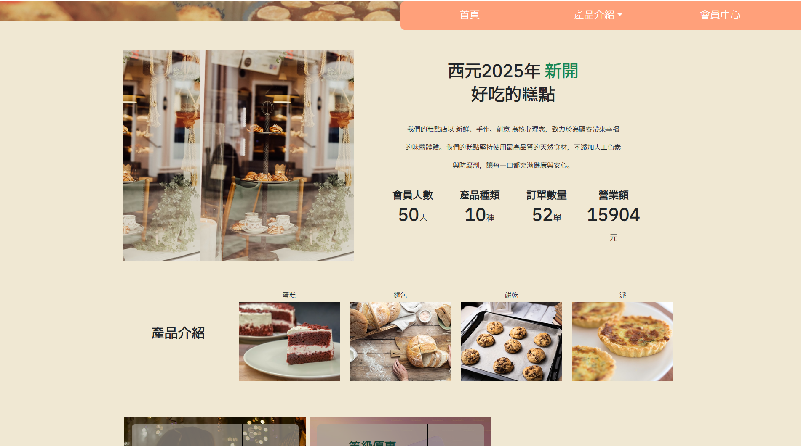
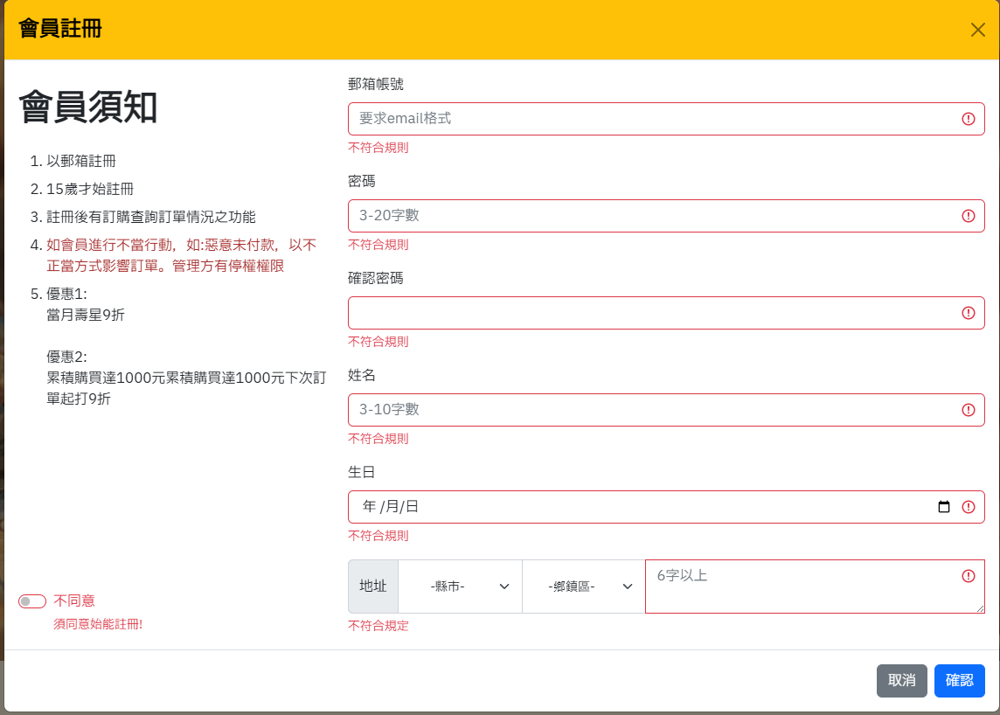
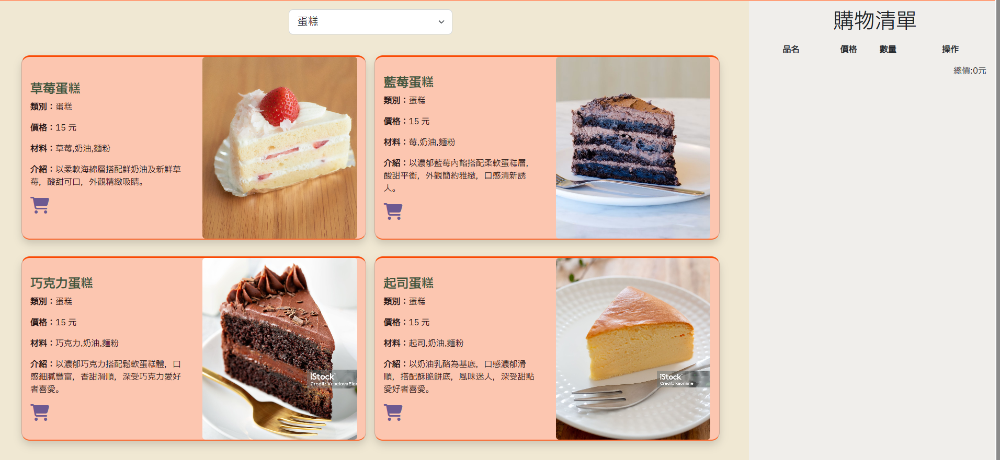
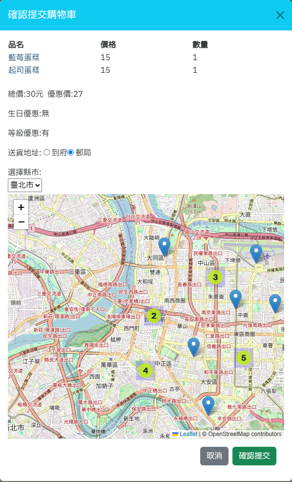
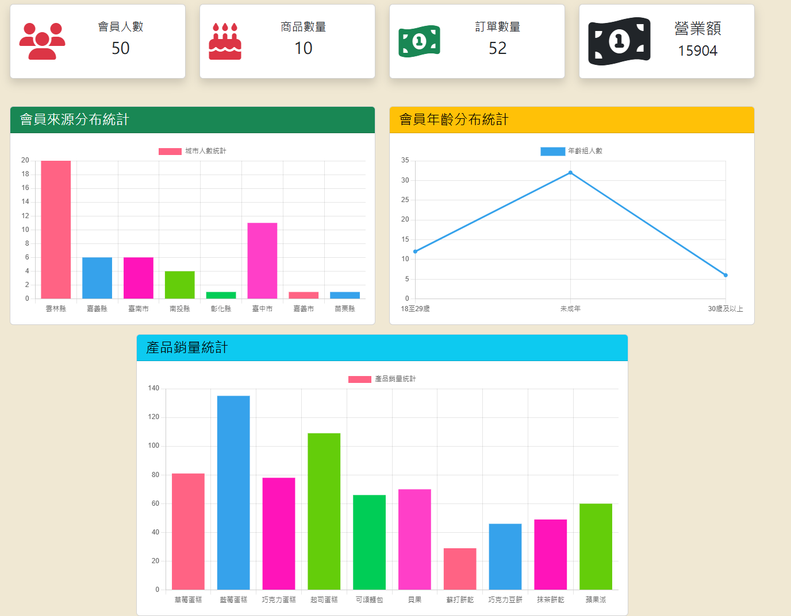
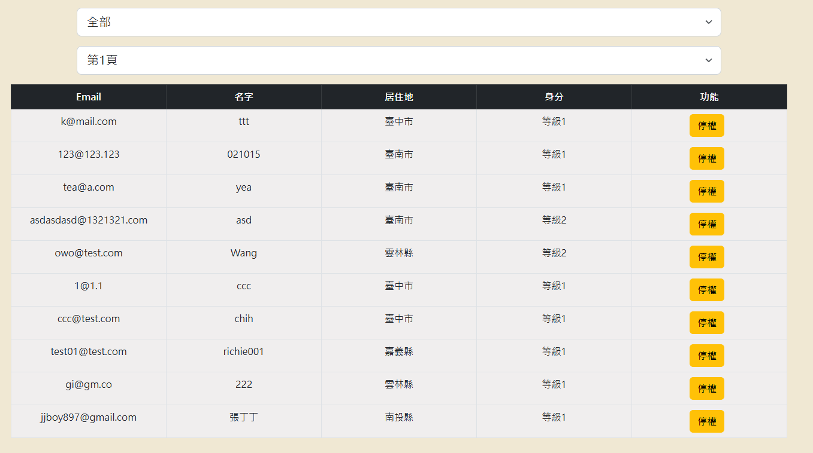
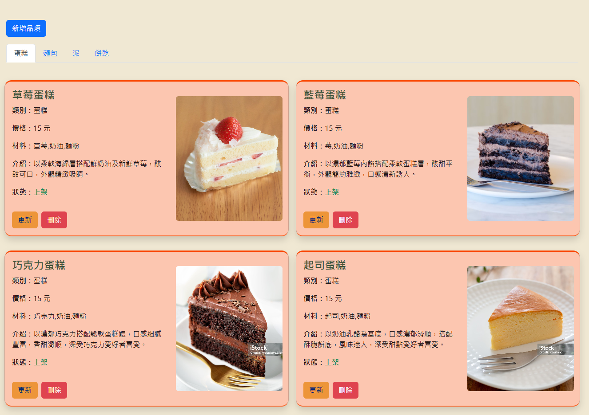
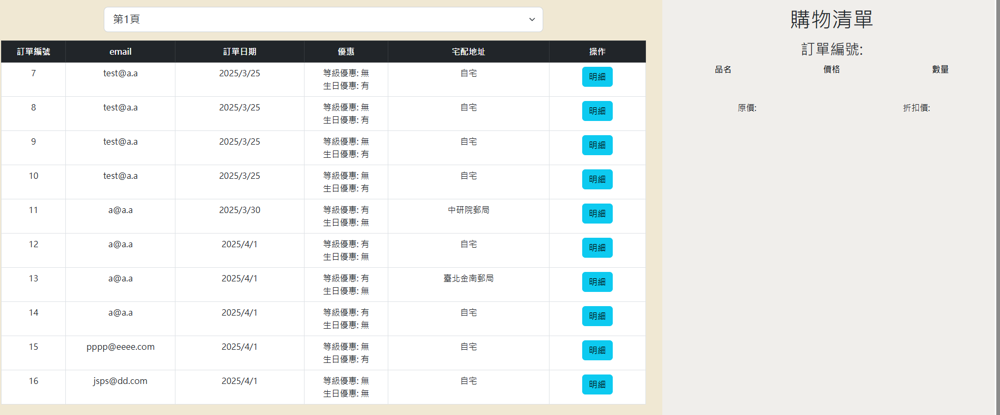

## 網站介紹

- ### 前台
  1. #### 首頁
     
     
     
  2. #### 登入註冊
    
     
  3. #### 購物頁
     
     

- ### 後台管理
  1. #### 圖表
     
     
  2. #### 會員管理
     
   
     
  3. #### 商品管理
     
     
  4. #### 訂單管理
     

## 技術

- CSS/ Bootstrap v5.1.3:rwd,排版
- laravel:blade,route,model,controller技術 會員權限控制進入會員中心後臺管理
- JS/ jQuery 3.7.1
- MySQL 4.1.3:CRUD,正規化,JOIN
- JS/ sweetalert2
- leaflet
- vue:vue組件
- js/chart.js
- js/counterup.js

## 功能簡介

前台網站

- RWD響應式網站
- 會員登入系統
  
會員中心
- vue組件搭配leaflet地圖傳送訂單資料
- 個人歷史訂單查詢
  
後臺管理
- 會員銷量圖表展示
- 會員管理:停權控制
- 商品管理:貨品建檔上下架
- 訂單管理:訂單紀錄

## 聯絡作者

你可以透過以下方式與我聯絡

- rogerhou2000@gmail.com
